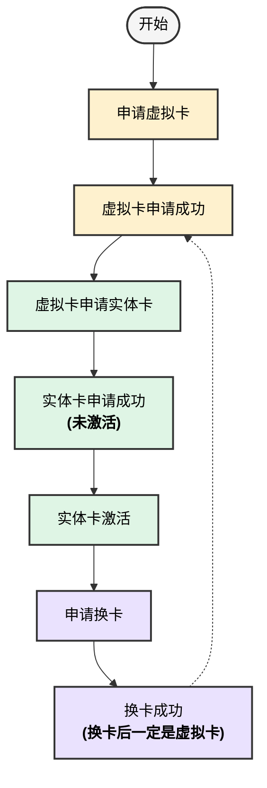
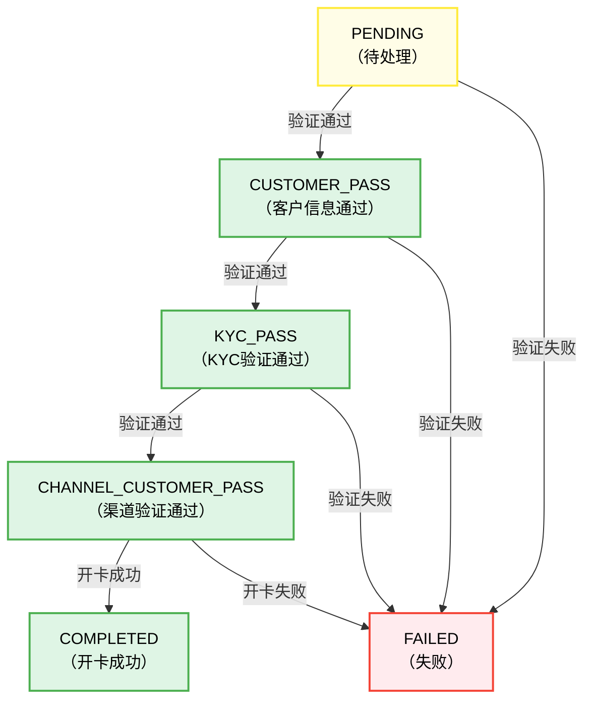
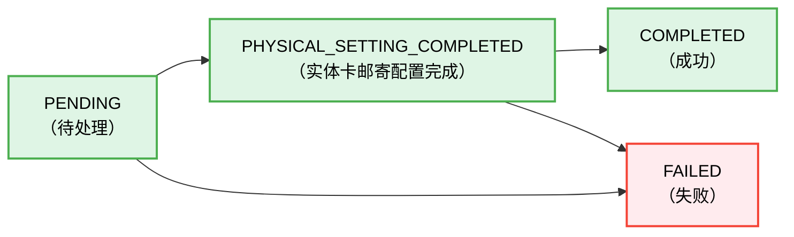
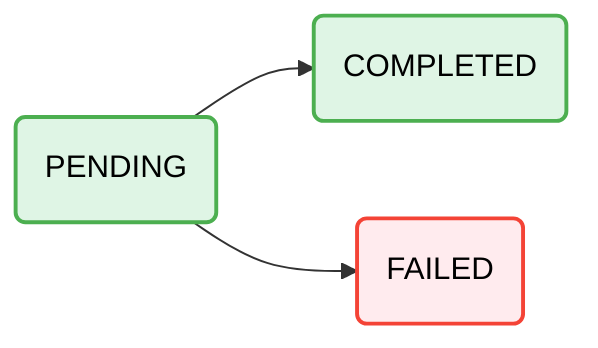

# Card

## 1. 概述

DCS平台提供灵活的卡片管理服务，支持多种类型的卡片创建、管理和使用。本文档详细介绍了平台支持的卡片类型、开卡接口选择指南、相关枚举定义以及卡片状态管理。

## 2. 卡片类型概览

### 按物理形态分类

| 卡片类型 | 代码 | 描述 | 适用场景 |
|---------|------|------|----------|
| 虚拟卡 | VIRTUAL | 仅提供卡号、有效期、CVV等信息，无实体卡片 | 在线支付、数字钱包、临时使用 |
| 实体卡 | PHYSICAL | 提供实体塑料/金属卡片，可用于线下刷卡 | 线下消费、ATM取现、长期使用 |

## 3. 开卡订单
### 3.1 接口分类
DCS提供以下开卡相关接口：
| 接口名称 | 接口路径 | 适用场景 | 功能说明 |
|---------|----------|----------|----------|
| 申请虚拟卡接口 | `/open-api/card-order/v1/apply-virtual` | 创建虚拟卡 | 所有卡片的起点，必须先申请虚拟卡 |
| 虚拟卡转实体卡接口 | `/open-api/card-order/v1/virtual-to-physical` | 虚拟卡升级为实体卡 | 需要先有激活状态的虚拟卡 |
| 换卡接口 | `/open-api/card-order/v1/replace` | 替换现有卡片 | 虚拟卡和实体卡都可换卡，但只能换成虚拟卡 |

### 3.2 开卡流程图

### 3.3 开卡订单状态机
#### 申请虚拟卡

#### 虚拟卡申请实体卡

#### 换卡

### 3.4 开卡参数字典

#### 地址证明文件类型 (poaDocType)
| code | name | desc |
|-------------|---------|---------|
| UTILITY_BILL | 公用事业账单 | 90天内（法国75天内） |
| BANK_STATEMENT | 银行对账单 | 90天内 |
| CREDIT_CARD_STATEMENT | 信用卡对账单 | 90天内 |
| LEASE_AND_PAYMENT | 租赁合同+付款凭证 | 付款凭证90天内 |
| MORTGAGE_AND_PAYMENT | 抵押贷款+付款凭证 | 付款凭证90天内 |
| DRIVING_LICENSE | 驾驶执照 | 未作为身份证件时可用，有效期至少1天 |
| OTHER_GOVERNMENT_ID | 其他政府证件 | 有效期至少1天 |
| ENTRY_ON_ELECTORAL_ROLL | 选民登记证明 | - |
| SALARY_STATEMENT | 工资单 | 90天内 |

#### 就业状态 (employmentStatus)
| code | name | desc |
|-------------|---------|------|
| EMPLOYED | 在职 | 有固定工作的受雇人员 |
| BUSINESS_OWNER | 企业主 | 拥有并经营企业的人员 |
| SELF_EMPLOYED | 自雇 | 自主经营、自由职业者 |
| UNEMPLOYED | 失业 | 暂时没有工作的人员 |
| PENSIONER | 退休 | 已退休领取养老金的人员 |
| STUDENT | 学生 | 在校学习的学生 |

#### 行业分类 (employmentJobIndustry)
| code | name | desc |
|----------|---------|----------|
| INFORMATION_AND_COMMUNICATIONS | 信息通信 | Information and Communications |
| RETAIL_TRADE | 零售贸易 | Retail Trade |
| FINANCIAL_AND_INSURANCE_ACTIVITIES | 金融保险 | Financial and Insurance Activities |
| ELECTRICITY_GAS_AND_WATER_SUPPLY | 电力燃气供水 | Electricity, Gas and Water Supply |
| TRANSPORT_AND_STORAGE | 运输仓储 | Transport and Storage |
| CONSTRUCTION | 建筑 | Construction |
| TRAVEL_RELATED | 旅游相关 | Travel Related |
| ACCOMMODATION_AND_FOOD_SERVICES_ACTIVITIES | 住宿餐饮 | Accommodation and Food Services Activities |
| ENTERTAINMENT | 娱乐 | Entertainment |
| PAYMENTS | 支付 | Payments |
| DIGITAL_PAYMENT_TOKEN_RELATED | 数字支付代币相关 | Digital Payment Token Related |
| PROFESSIONAL | 专业服务 | Professional |
| LUXURY_GOODS | 奢侈品 | Luxury Goods |
| MANUFACTURING | 制造业 | Manufacturing |
| MINING_AND_QUARRYING | 采矿 | Mining and Quarrying |
| AGRICULTURE_AND_FISHING | 农业渔业 | Agriculture and Fishing |
| REAL_PROPERTY_AND_DEVELOPMENT_OF_LAND | 房地产开发 | Real Property and Development of Land |
| WHOLESALE_TRADE | 批发贸易 | Wholesale Trade |
| OTHERS | 其他 | Others |

#### 职业（occupation）
| code | name | number |
|---------|---------|---------|
| PHYSIOTHERAPIST | 理疗师 | 308 |
| SPECIALIST | 专家 | 309 |
| SURGEON | 外科医生 | 303 |
| PATHOLOGIST | 病理学家 | 304 |
| PLASTIC_SURGEON | 整形外科医生 | 318 |
| PSYCHOLOGIST | 心理学家 | 314 |
| SR_EXECUTIVE | 高级主管 | 180 |
| CHAIRMAN | 董事长 | 106 |
| MANAGING_DIR | 董事总经理 | 108 |
| JR_EXECUTIVE | 初级主管 | 200 |
| TERTIARY_STUDENT | 大专学生 | 2222 |
| UNKNOWN | 未知职业 | 1200 |
| GENERAL_WORKER | 普通工人 | 1198 |
| UNEMPLOYED | 失业人员 | 1199 |
| PILOT | 飞行员 | 1169 |
| AIR_STEWARD_STEWARDESS | 空乘人员 | 1170 |
| CLERK | 文员 | 1157 |
| CUST_SERVICE_CONSULTANT | 客服顾问 | 1156 |
| ARTIST_ENTERTAINMENT | 艺人/演艺人员 | 1183 |
| BEAUTY_CONSULTNT_STYLIST | 美容顾问/造型师 | 1184 |
| SOCIAL_WORKER | 社工 | 1141 |
| TECHNICAL_CONSULTANT | 技术顾问 | 1131 |
| IT_CONSULTANT | IT顾问 | 1123 |
| COMPUTER_ANALYST | 计算机分析师 | 1124 |
| TECHNICIAN | 技术员 | 1151 |
| WAREHOUSING_PERSONNEL | 仓库管理员 | 1152 |
| SYSTEMS_PROGRAMMER | 系统程序员 | 1121 |
| TEACHER | 教师 | 1113 |
| INSTRUCTOR | 教练/讲师 | 1114 |
| ASST_PROFESSOR | 副教授 | 1107 |
| VICE_DEAN | 副院长 | 1104 |
| PROFESSOR | 教授 | 1106 |
| APPLICATION_PROGRAMMER | 应用程序员 | 1122 |
| OTHERS | 其他职业 | 1100 |
| REMISIER | 经纪商 | 1040 |
| PROPERTY_AGENT | 房地产经纪人 | 1050 |
| SALES_EXEC | 销售主管 | 1020 |
| MARKETING_EXEC | 营销主管 | 1010 |
| HAWKER | 摊贩 | 990 |
| CONTRACTOR | 承包商 | 985 |
| PARTNER | 合伙人 | 970 |
| ARMY_SPECIALIST | 陆军专员 | 860 |
| CIVIL_SERVANT | 公务员 | 840 |
| DEPUTY_PM | 副总理 | 807 |
| CABINET_MINISTER | 内阁部长 | 809 |
| BANKING_PROFESSIONAL | 银行专业人士 | 660 |
| BANKER_FUND_MANAGER | 银行家/基金经理 | 650 |
| POLITICIAN_CIVIL_SERVANT | 政治人物/公务员 | 800 |
| DRAFTSMAN | 制图员 | 740 |
| QUANTITY_SURVEYOR | 工料测量师 | 750 |
| CHEM_ENGINEER | 化学工程师 | 540 |
| FIN_CONTROLLER | 财务总监 | 610 |
| PROF_ACCOUNTANCY | 会计师 | 600 |
| HIGH_COURT_JUDGE | 高等法院法官 | 406 |
| CHIEF_JUSTICE | 首席大法官 | 401 |
| AUDITOR_GENERAL | 总审计长 | 403 |
| CIVIL_ENGINEER | 土木工程师 | 510 |
| ELEC_ENGINEER | 电气工程师 | 520 |
| LEGAL_ADVISER | 法律顾问 | 490 |
| PROF_ENGINEER | 工程师 | 500 |
| JUDGE | 法官 | 408 |
| LAWYER | 律师 | 420 |
| DOCTOR | 医生 | 360 |
| GEN_PRACTITIONER | 全科医生 | 365 |
| RESEARCHER | 研究员 | 350 |
| BIOCHEMIST | 生物化学家 | 351 |
| GYNAECOLOGIST | 妇科医生 | 322 |
| MATRON | 护士长 | 380 |
| ORTHOPAEDICIAN | 骨科医生 | 310 |
| OFFICER | 军官 | 250 |
| PROF_MEDICAL | 医学专家 | 300 |
| OBSTETRICIAN | 产科医生 | 320 |
| PSYCHIATRIST | 精神科医生 | 316 |
| MGT_CONSULTANT | 管理顾问 | 160 |
| REG_MANAGER | 区域经理 | 140 |
| DIV_MANAGER | 部门经理 | 150 |
| TOP_EXECUTIVE | 高级管理层 | 110 |
| GENERAL_MGR | 总经理 | 130 |
| DEPT_MANAGER | 部门主管 | 210 |
| EXEC_OFFICER | 行政主任 | 230 |
| PRESIDENT | 总裁 | 102 |
| V_PRESIDENT_DIR | 副总裁/董事 | 104 |
| SECURITY_SAFETY_PERSON | 安保人员 | 1196 |
| HOSPITALITY_PERSONNEL | 酒店从业人员 | 1197 |
| HOUSEWIFE | 家庭主妇 | 1190 |
| STUDENT | 学生 | 1191 |
| COOK_CHEF | 厨师 | 1180 |
| DRIVER | 驾驶员 | 1181 |
| DIVER | 潜水员 | 1160 |
| SECRETARY | 秘书 | 1155 |
| DESIGNER | 设计师 | 1182 |
| SUPERVISOR | 主管 | 1150 |
| EDITOR | 编辑 | 1145 |
| JOURNALIST | 记者 | 1146 |
| PASTOR | 牧师 | 1140 |
| PROJECT_CO_ORDINATOR | 项目协调员 | 1130 |
| SYSTEMS_ANALYST | 系统分析师 | 1120 |
| PRINCIPAL | 校长 | 1110 |
| V_PRINCIPAL | 副校长 | 1111 |
| LECTURER | 讲师 | 1108 |
| DEAN | 院长 | 1103 |
| CHANCELLOR | 大学校长 | 1101 |
| INSURANCE_AGENT | 保险代理 | 1030 |
| SALESMAN | 销售员 | 1000 |
| SOLE_PROPRIETOR | 独资经营者 | 980 |
| SELF_EMPLOYED | 自雇人士 | 910 |
| BUSINESS | 企业主 | 900 |
| POLICE | 警察 | 850 |
| AMBASSADOR | 大使 | 820 |
| PARLIAMENTARY_SECRETARY | 国会秘书 | 830 |
| AUDITOR | 审计员 | 640 |
| V_PRESIDENT | 副总裁 | 803 |
| PRIME_MINISTER | 总理 | 805 |
| PROF_ARCHITECT | 建筑师 | 700 |
| ARCHITECT | 建筑师 | 701 |
| MECH_ENGINEER | 机械工程师 | 550 |
| SYSTEMS_ENGINEER | 系统工程师 | 560 |
| PROCESS_ENGINEER | 工艺工程师 | 530 |
| ASST_ACCOUNTANT | 助理会计师 | 622 |
| CREDIT_ANALYST | 信用分析师 | 630 |
| TREASURER | 财务主管 | 612 |
| ACCOUNTANT | 会计师 | 620 |
| FIN_CONSULTANT | 财务顾问 | 601 |
| HEALTHCARE_PROFESSIONAL | 医疗专业人员 | 390 |
| PROF_LAW | 法律专家 | 400 |
| DENTIST | 牙医 | 340 |
| CHIEF_NURSE | 护士长 | 382 |
| NURSE | 护士 | 383 |
| RADIOGRAPHER | 放射技师 | 370 |
| PHARMACIST | 药剂师 | 368 |

#### 就业资历 (jobSeniority)
| code | name | desc |
|----------|---------|----------|
| SENIOR_MANAGEMENT | 高级管理层 | Senior Management |
| DIRECTOR | 董事 | Director |
| PARTNER | 合伙人 | Partner |
| EXECUTIVE | 高管 | Executive |
| TEACHER | 教师 | Teacher |
| MANAGERIAL | 管理层 | Managerial |
| SUPERVISOR | 主管 | Supervisor |
| SALES | 销售 | Sales |
| ASSOCIATE | 助理 | Associate |
| DIPLOMAT | 外交官 | Diplomat |
| OTHERS | 其他 | Others |

#### 开户目的 (purposeOfAccount)
| code | name | desc |
|----------|---------|----------|
| CASH_ADVANCE_PROGRAM | 现金预支项目 | Cash Advance Program |
| INVESTMENT | 投资 | Investment |
| DAILY_SPENDING | 日常消费 | Daily Spending |
| BILL_PAYMENT | 账单支付 | Bill Payment |
| OTHERS | 其他 | Others |

#### 资金来源 (sourceOfFunds)
| code | name | desc |
|----------|---------|----------|
| OWN_BANK_ACCOUNT | 自有银行账户 | Own Bank Account |
| THIRD_PARTY_BANK_ACCOUNT | 第三方银行账户 | Third Party Bank Account |
| CRYPTO_TOP_UP | 加密货币充值 | Crypto Top Up |
| DUSD | DUSD | DUSD |
| OTHERS | 其他 | Others |

#### 财富来源 (sourceOfWealth)
| code | name | desc |
|----------|---------|----------|
| EMPLOYMENT | 就业收入 | Employment |
| SAVINGS | 储蓄 | Savings |
| INHERITANCE | 继承 | Inheritance |
| BUSINESS | 经营收入 | Business |
| INVESTMENT | 投资收益 | Investment |
| TRUST_FUND | 信托基金 | Trust Fund |
| CRYPTOCURRENCIES | 加密货币 | Cryptocurrencies |
| OTHERS | 其他 | Others |

## 4. 卡管理
### 卡管理接口
| 接口名称 | HTTP方法 | 端点 | 功能描述 |
|----------|----------|------|----------|
| 查询卡详情 | GET | `/open-api/card/v1/detail` | 获取单张卡片基本信息（无敏感信息） |
| 查询卡列表 | GET | `/open-api/card/v1/list` | 根据用户ID查询该用户的所有卡片 |
| 获取卡敏感信息 | POST | `/open-api/card/v1/retrieve-secure-card` | 获取完整卡号、CVV、有效期等敏感信息 |
| 冻结/解冻卡 | POST | `/open-api/card/v1/freeze` | 临时冻结或解冻卡片使用 |
| 注销卡 | POST | `/open-api/card/v1/terminate` | 永久注销卡片，不可恢复 |

### 实体卡专用接口
| 接口名称 | HTTP方法 | 端点 | 功能描述 |
|----------|----------|------|----------|
| 激活实体卡 | POST | `/open-api/card/v1/physical-active` | 激活收到的实体卡，激活后方可使用 |
| 重置PIN码 | POST | `/open-api/card/v1/reset-pin` | 重置或修改实体卡的PIN密码 |
| 获取卡寄送信息 | GET | `/open-api/card/v1/shipping-info` | 查询实体卡的邮寄状态和物流信息 |

### 卡片状态说明
- `PENDING_ACTIVATION`: 等待激活（仅实体卡）
- `ACTIVATED`: 已激活，可正常使用
- `FROZEN`: 已冻结，暂停使用。Enterprise/用户发起的解冻，Enterprise可以解冻
- `BLOCKED`: 已锁定。发卡行发起的冻结，Enterprise无法解冻
- `INVALID`: 已注销，永久失效

注意
>1. **虚拟卡特点**: 创建成功后直接处于激活状态，无需额外激活步骤
>2. **实体卡特点**: 创建后处于等待激活状态，必须收到实体卡后调用激活接口才能使用
>3. **卡号关系**: 虚拟卡转实体卡后，生成的实体卡有新的cardId，但卡号保持一致
>4. **换卡**: 换卡后，卡号会发生变化。如果是实体卡换卡，换完后是虚拟卡，还需要重新转实体卡。
>4. **PCI要求**: 获取敏感信息接口需要PCI证件认证
>5. **并存使用**: 虚拟卡转实体卡后，在实体卡激活前，虚拟卡仍可正常使用

