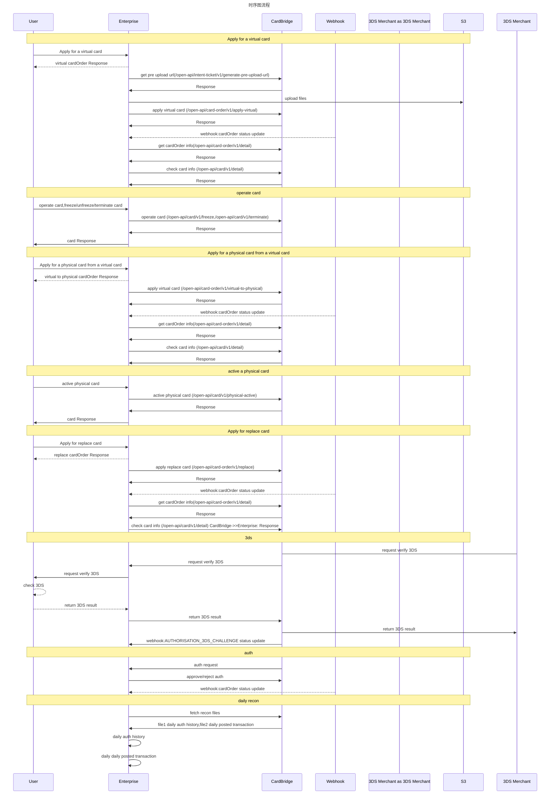

# 指引
欢迎使用Auth Forwarding模式API指南。本快速入门指南将引导您了解如何获取沙盒API密钥、健全RSA密钥等，并了解在我们的沙盒环境中获得顺畅入门体验的关键先决条件。

# 项目概述
## Auth Forwarding模式说明
Auth Forwarding模式（授权模式）将持卡人的消费额度控制权赋予第三方机构。该机构通过额度分配的方式，允许持卡人在一定范围内进行消费，同时消耗该机构的担保金。

## PCI合规要求
🎗 重要提示：请根据您的公司是否持有PCI牌照来选择使用相应的接口。如果您持有PCI证件，请提前告知DCS团队并出示相关证件。

## 环境配置

| 环境 | URL  |
| :--:| :--: |
| 沙盒环境  | https://api.uatdcd.com    |
| 生产环境  | https://api.thedecard.com |


## 公共声明
1. 所有的时间都是UTC+8的时区
2. 如没有特殊声明，Enterprise代指您的团队
3. 所有的币种均为ISO货币代码的3位数据代码
4. 国家码参数，如果未额外说明，均为ISO国家码2位数据代码

# API认证
## 前置准备
你需要从我们得到的配置
| 字段  | 描述  |
| :--:  | :--:  |
| apiKey    | 调用open-api使用的key           |
| secretKey | 调用open-api鉴权的key，请妥善保管 |

ApiKey 作为一种全局唯一的标识符，方便用户身份识别以及数据分析。为防止恶意使用别人的ApiKey来发起请求，会采用配对 SecretKey 的方式
AKSK通常会组合生成一套签名，并按照一定规则进行加密处理。在请求方发起请求时，需要将这个签名值一并提交给提供方进行验证。
我们把AKSK私下交付三方平台，三方平台对OPENAPI的任何接口调用都应该遵循约定的签名协议。

你需要提供的配置
| 字段  | 描述  |
| :--:  | :--:  |
| webhookUrl    | webhook通知地址 |
| authUrl | 授权通知地址 |
| externalPublicKey | authUrl通知使用到的RSA公钥 |


## 接口鉴权
### 签名规则
使用 HmacSHA256 算法生成签名，签名计算规则如下：
sign(API-KEY + TIMESTAMP + NONCE + payload)

参数说明

- PAYLOAD: GET请求使用URL编码查询参数，其他请求使用请求体
```
  if method is GET :
      payload = original.url().encodedQuery();
  else :
      payload = Body;
```
- TIMESTAMP: 防止请求重放，默认只处理5秒内的有效请求
- NONCE: 随机数[10000,99999]，实现请求一次性有效

签名算法
```
JS
// Pre-request script to generate HMAC-SHA256 signature in Postman
const CryptoJS = require('crypto-js');

// Define your API secret here
const apiSecret = '{your secret api}';
const apiKey = '{your api key}';


// Get the request URL and query parameters (if GET request)
const queryParams = '{your query param}';
const requestBody = '{your request body}';
const nonce = 10010;
const timestamp = Date.now().toString()

// Combine request URL, query parameters, request body (for POST), and current timestamp
const dataToSign = apiKey + timestamp + nonce + queryParams + requestBody ;

// Generate the signature
const signature = getSignature(dataToSign, apiSecret);

// Function to generate HMAC-SHA256 signature
function getSignature(data, secret) {
    try {
        return CryptoJS.HmacSHA256(data, secret).toString(CryptoJS.enc.Hex);
    } catch (error) {
        throw new Error('Failed to calculate hmac-sha256: ' + error.message);
    }
}
```

```
Java
import lombok.extern.log4j.Log4j2;
import org.apache.commons.codec.binary.Hex;

import javax.crypto.Mac;
import javax.crypto.spec.SecretKeySpec;

@Log4j2
public final class HmacSignature{
    private static final String HMAC_SHA256 = "HmacSHA256";

    public static String getSignature(String apiSecret, String data) {
        byte[] hmacSha256 = new byte[0];
        try {
            SecretKeySpec secretKeySpec = new SecretKeySpec(apiSecret.getBytes(), HMAC_SHA256);
            Mac mac = Mac.getInstance(HMAC_SHA256);
            mac.init(secretKeySpec);
            hmacSha256 = mac.doFinal(data.getBytes());
        } catch (Exception e) {
            log.error("Failed to calculate HMAC SHA256 signature", e);
        }
        return Hex.encodeHexString(hmacSha256);
    }
}
```

示例
```
curl --location 'http://{domain}/open-api/card-order/v1/detail?cardOrderRef=14' \
--header 'X-DAPI-API-KEY: 697EA72DACF742F280943DAB211E6C2B' \
--header 'X-DAPI-TIMESTAMP: 1743044911331' \
--header 'X-DAPI-NONCE: 10100' \
--header 'X-DAPI-SIGN: b979d2ea5c70187ddac7d7a5937c40c87a58f765594b740e596d25fca96f2dcb'
```


# 生产环境的AKSK安全传输
为保证生产环境的AKSK不会泄露其他第三方，请按照以下流程获取AKSK。
1. 请提供一个安全邮箱地址和一个获取AKSK的请求IP。邮箱是接收AKSK的获取流程，IP会被加入获取AKSK的白名单
2. 安全邮箱会接收到我们发送的邮件，邮件中会有一个临时安全链接（**仅一次提取有效**）。邮箱会收到以下内容

    | 名称              | 类型   | 描述                 |
    |-----------------|------|--------------------|
    | expireTime      | string | extract secret key 有效期 |
    | extractSecretKey | string | 秘钥提取安全码            |
    | extractUrl      | string | 秘钥提取URL            |
    | howToUse        | string | 使用方式               |
    | notes           | string | 秘钥只能被提取一次          |
3. 把extractUrl和extractSecretKey拼接到一起，获取AKSK。

- 成功响应
```
{
    "code": "SYS_SUCCESS",
    "message": null,
    "messageDetail": null,
    "data": {
        "expireTime": "2024-10-21T16:52+08:00[Asia/Shanghai]",
        "extractSecretKey": "4f72b1e9c49e
        4ac1bbc2cd12b5e44993",
        "extractUrl": "https://api-testnet.thedecard.com/internal/open-api/v1/secret-extract/",
        "howToUse": "Please concatenate the url with the secret-key and execute it on the specified machine.",
        "notes": "This link is only valid for one AKSK extraction, if the content is not properly accessed, the AKSK may have been compromised, please contact us promptly."
    },
    "success": true
}
```
- 失败响应
```
{
    "code": "ERROR-CODE",
    "message": "simple describe, see error-code list",
    "success": false
}
```

```angular2html
注意：如果没有成功到AKSK，则说明可能在有效期内已经造成了秘钥丢失。需商务沟通后重新发送邮件
```


# 最佳实践
1. 先联系我们，告知你需要发行的卡类型（虚拟/实体），卡组，card bin等。我们会为您生成一个Enterprise和Card profile，Enterprise会有apiKey和secretKey，Card profile会有profile id。
2. 需要您上传webhook url、auth url和external public key，为webhook通知和授权通知做准备
3. 开卡
   1. 创建虚拟卡
   2. 根据Card Order Id查询Card Order状态。当Card Order成功，Card Order中会有一个card Id，此时是一张虚拟卡（虚拟卡不需要激活，直接就是激活状态）
   3. 可以对卡进行冻结/解冻/注销（用card Id操作）
   4. 获取卡号/CVV等敏感信息
      1. 如果客户有PCI，用Get Secure Card
   5. 有了虚拟卡，还可以申请把虚拟卡转换成物理卡。当Card Order成功，Card Order中会有一个card Id，此时会有一个新的实体卡card Id（实体卡和虚拟卡是不同的cardId，但是卡号是相同的）。此时实体卡未激活，实体卡不可用，但是可以正常使用虚拟卡。
   6. 当实体卡邮寄到用户手中之后，需要把实体卡激活
   7.  有了实体卡，同样可以冻结/解冻/注销，此外还可以重置PIN。（用card Id操作）
4.  用户刷卡，DCS通知Enterprise授权
5.  每天结束会生成交易流水文件和授权记录文件，方便enterprise的对账


