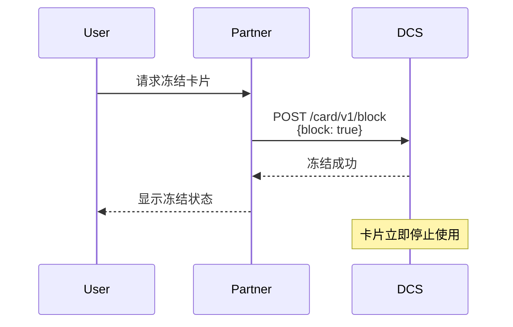
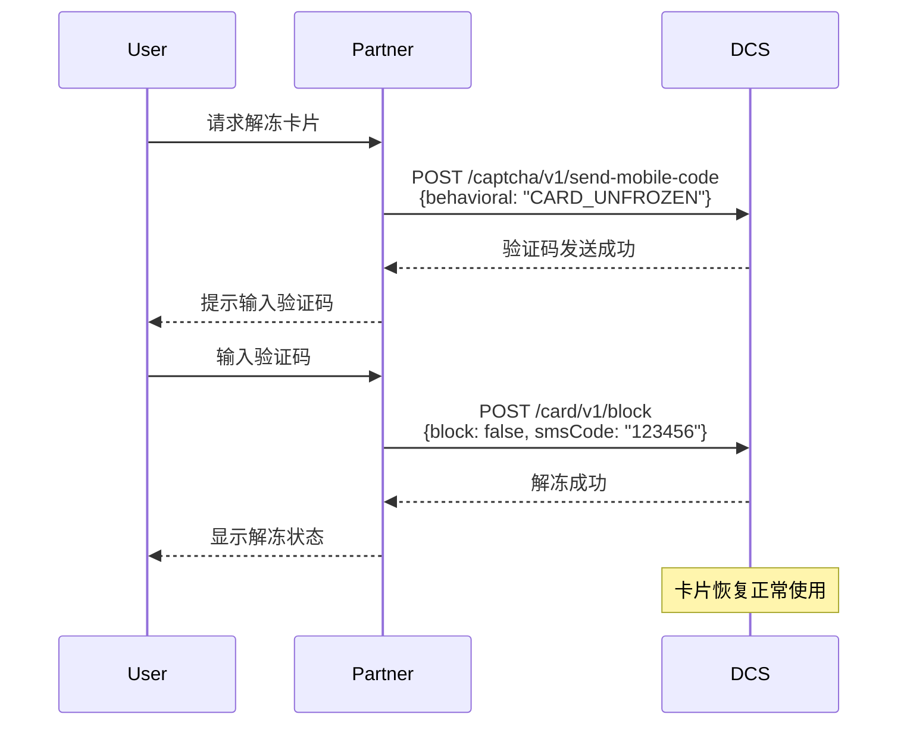

# 卡片冻结/解冻操作指南

本文档详细介绍如何冻结和解冻 DCS 卡片，包括操作流程、安全验证和注意事项。

## 功能概述

### 冻结功能
- **即时生效**：冻结操作立即生效，卡片立即停止所有交易
- **安全保护**：防止卡片被盗用或异常使用
- **可逆操作**：可以随时通过解冻恢复卡片使用

### 解冻功能
- **安全验证**：需要短信验证码确认身份
- **身份确认**：确保是卡片持有人本人操作
- **状态恢复**：解冻后卡片恢复正常使用状态

## 操作流程

### 冻结卡片流程

1. **发起冻结请求**
   - 用户在应用中选择冻结卡片功能
   - 系统确认用户身份和卡片状态

2. **执行冻结操作**
   - 调用卡片冻结接口 `/card/v1/block`
   - 设置 `block` 参数为 `true`
   - 系统立即冻结卡片

3. **确认冻结结果**
   - 系统返回冻结成功确认
   - 卡片状态更新为冻结
   - 用户收到冻结成功通知

### 解冻卡片流程

1. **发起解冻请求**
   - 用户选择解冻卡片功能
   - 系统检查卡片当前为冻结状态

2. **发送验证码**
   - 调用验证码接口 `/captcha/v1/send-mobile-code`
   - 设置 `behavioral` 参数为 `CARD_UNFROZEN`
   - 系统向用户手机发送6位验证码

3. **输入验证码**
   - 用户在应用中输入收到的验证码
   - 系统验证验证码的有效性和时效性

4. **执行解冻操作**
   - 调用卡片解冻接口 `/card/v1/block`
   - 设置 `block` 参数为 `false`
   - 提供 `smsCode` 验证码参数

5. **确认解冻结果**
   - 系统验证通过后解冻卡片
   - 卡片状态恢复为正常
   - 用户收到解冻成功通知

### 相关接口

| 接口                             | 方法   | 用途                                                        |
|--------------------------------|------|-----------------------------------------------------------|
| `/captcha/v1/send-mobile-code` | POST | [发送验证码](../../API%20Reference/captcha/readme.md)(解冻的时候需要) |
| `/card/v1/block`               | POST | 执行[冻结/解冻](../../API%20Reference/card/readme.md#2-冻卡解冻)操作  |

### 请求参数说明

**冻结卡片时需要提供：**
- `externalUserId`：用户ID
- `block`：设置为 `true`
- `cardMantissa`：卡号后4位（多卡用户必填）

**解冻卡片时需要提供：**
- `externalUserId`：用户ID
- `block`：设置为 `false`
- `smsCode`：短信验证码
- `cardMantissa`：卡号后4位（多卡用户必填）

## 多卡管理

### 卡片识别
对于拥有多张卡片的用户，系统通过卡号后四位（`cardMantissa`）来区分不同的卡片：

- **单卡用户**：可以不提供 `cardMantissa`，系统默认操作第一张卡片
- **多卡用户**：必须提供 `cardMantissa` 来指定要操作的具体卡片

### 操作建议
- 在操作前先查询用户的卡片列表
- 明确显示要操作的卡片信息（卡号后四位）
- 确认用户选择了正确的卡片后再执行操作

## 安全验证

### 冻结操作安全
- **无需额外验证**：冻结操作为保护性操作，可立即执行
- **操作记录**：系统记录所有冻结操作的时间和用户
- **状态确认**：操作后立即确认卡片状态变更

### 解冻操作安全
- **短信验证**：必须提供有效的短信验证码
- **时效限制**：验证码有效期为5分钟
- **频率限制**：限制验证码发送频率，防止恶意操作
- **身份确认**：确保只有卡片持有人能够解冻

## 状态管理

### 卡片状态变化
- **冻结前状态**：通常为 `NORMAL`（正常）或 `ACTIVE`（激活）
- **冻结后状态**：变更为 `FROZEN`（冻结）
- **解冻后状态**：恢复为 `NORMAL`（正常）

### 状态检查
在执行冻结/解冻操作前，建议先检查卡片当前状态：
- 只有正常状态的卡片才能冻结
- 只有冻结状态的卡片才能解冻
- 避免重复操作和无效操作
