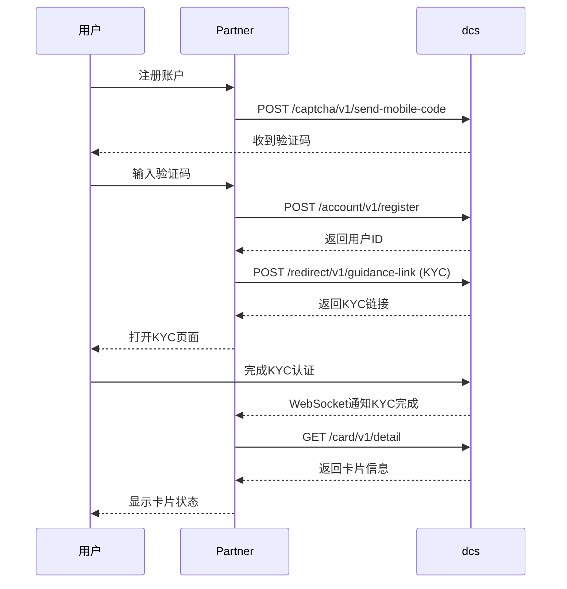
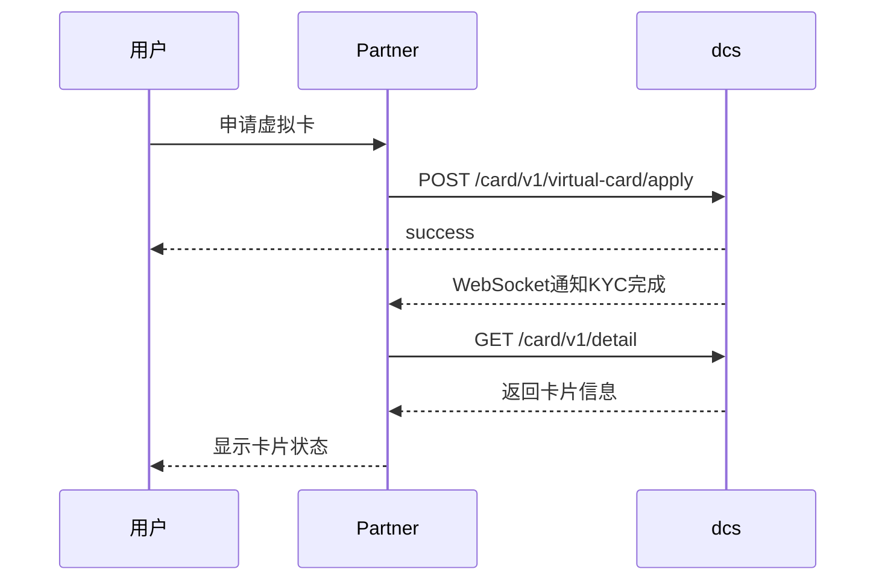
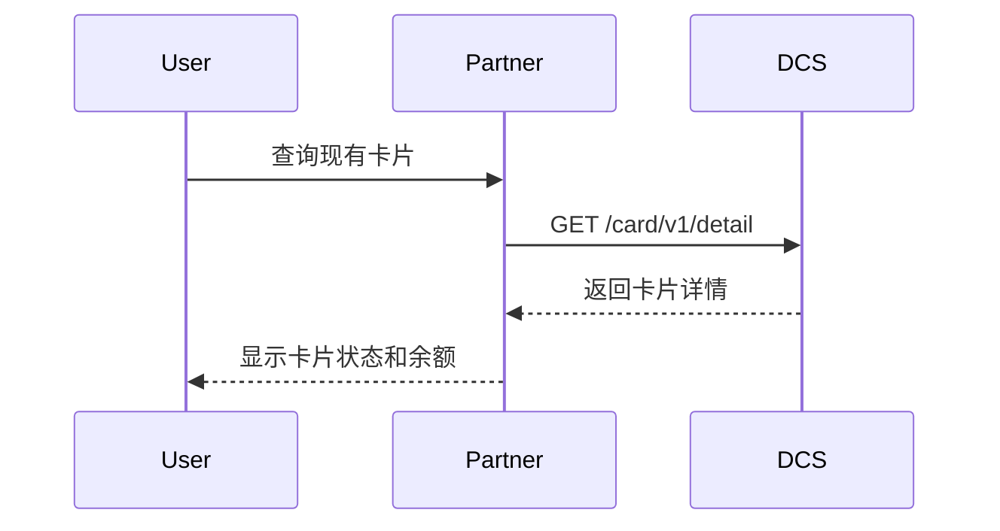

# 卡片查询和管理指南

本指南详细介绍如何查询 DCS Standard Authorization 卡片，包括卡片列表查询、状态查询和基本管理操作。

## 功能概述

DCS Standard Authorization 平台提供以下卡片相关功能：

### 卡片管理功能
- **卡片创建**：卡片创建
- **卡片详情查询**：查看用户现有卡片的详细信息
- **卡片状态管理**：查询和管理卡片状态
- **交易记录查询**：查看账单和法币变动信息

### 卡片创建
    创建卡分为2种方式，第一种是通过H5页面完成KYC认证，第二种是通过open api申请虚拟卡。
#### H5 guid 创建

流程
1. **[发送验证码](../../API%20Reference/captcha/readme.md#1-发送短信验证码)**：用于注册用户手机号获取短信验证码
3. **[获取kyc链接](../../API%20Reference/account/readme.md#2-获取引导页链接)**：用户根据kyc链接进行kyc认证
4. **[监听WebSocket KYC 通知](../../API%20Reference/websocket/readme.md#kyc状态-kyc_status)**：监听KYC状态

#### open api 创建

流程
1. **[申请虚拟卡](../../API%20Reference/card/readme.md#6-申请虚拟卡)**：用于申请虚拟卡
2. **[监听WebSocket KYC 通知](../../API%20Reference/websocket/readme.md#kyc状态-kyc_status)**：监听KYC状态

### 查询卡片详情和状态

**功能描述：** 查看用户现有卡片的详细信息和状态

**使用场景：**
- 查看卡片基本信息
- 检查卡片当前状态
- 查询卡片余额信息
- 多卡用户管理不同卡片

**返回信息：**
- 卡片类型和卡号（后4位）
- 持卡人姓名和卡片图片
- 卡片状态和实体卡状态
- 钱包余额、CA余额、卡片可用余额
- 用户积分信息

**卡片状态说明：**
- `NORMAL`：正常状态，可以正常使用
- `FROZEN`：冻结状态，暂停使用
- `CANCELLED`：已取消，无法使用

**实体卡状态说明：**
- `UN_APPLY`：未申请实体卡
- `INACTIVE`：实体卡未激活
- `ACTIVE`：实体卡已激活
- `REPLACE`：需要更换实体卡
- `FROZEN`：实体卡冻结
- `CANCELLED`：实体卡已取消

详细接口说明请参考：[卡片详情查询 API](../../API%20Reference/card/readme.md#1-卡详情状态查询)

### 卡片查询

### 查询卡片详情和状态

**功能描述：** 查看用户现有卡片的详细信息和状态

**使用场景：**
- 查看卡片基本信息
- 检查卡片当前状态
- 查询卡片余额信息
- 多卡用户管理不同卡片

**返回信息：**
- 卡片类型和卡号（后4位）
- 持卡人姓名和卡片图片
- 卡片状态和实体卡状态
- 钱包余额、CA余额、卡片可用余额
- 用户积分信息

**卡片状态说明：**
- `NORMAL`：正常状态，可以正常使用
- `FROZEN`：冻结状态，暂停使用
- `CANCELLED`：已取消，无法使用

**实体卡状态说明：**
- `UN_APPLY`：未申请实体卡
- `INACTIVE`：实体卡未激活
- `ACTIVE`：实体卡已激活
- `REPLACE`：需要更换实体卡
- `FROZEN`：实体卡冻结
- `CANCELLED`：实体卡已取消

详细接口说明请参考：[卡片详情查询 API](../../API%20Reference/card/readme.md#1-卡详情状态查询)

### 卡片状态管理

**功能描述：** 对卡片进行冻结和解冻操作

**冻结操作：**
- 立即生效，卡片停止所有交易
- 用于保护账户安全
- 无需额外验证

**解冻操作：**
- 需要短信验证码确认
- 确保操作安全性
- 解冻后恢复正常使用

**多卡管理：**
- 通过卡号后4位区分不同卡片
- 单卡用户可省略卡号参数
- 多卡用户必须指定具体卡片

详细操作说明请参考：[卡片冻结/解冻操作指南](block.md)

## 交易记录查询

### 账单管理

**账单列表功能：**
- 查看卡片账单列表
- 区分已出账单和未出账单
- 显示SGD和USD两种币种金额

**账单详情功能：**
- 查看具体账单的详细交易记录
- 包含商户信息和交易金额
- 显示资产变动明细

**账单类型：**
- `NOT_POSTED`：未出账单
- `POSTED`：已出账单

详细接口说明请参考：
- [卡账单列表 API](../../API%20Reference/card/readme.md#3-卡账单列表)
- [卡账单详情 API](../../API%20Reference/card/readme.md#4-卡账单详情)

### 法币变动记录

**功能描述：** 查询用户的法币入账记录

**记录内容：**
- 交易金额和币种
- 商户名称和交易时间
- 充值渠道信息
- 转账详细信息

**支持的充值渠道：**
- F - FOMO Pay
- T - D Token  
- 6 - APP
- 8 - PayNow
- 9 - DBS VA
- R - VA转账
- O - 境外银行
- W - 提现
- Y - TripleA

详细接口说明请参考：[法币变动记录查询 API](../../API%20Reference/card/readme.md#5-查询法币变动记录)

## 重要提醒

> [!WARNING]
> ### 卡片操作注意事项
> - 卡片查询需要提供正确的用户ID
> - 多卡用户需要通过卡号后4位区分不同卡片
> - 解冻操作需要短信验证码，请确保手机号正确

> [!CAUTION]
> ### 查询限制
> - 交易历史查询每页最多100条记录
> - 账单详情查询需要提供正确的账单ID
> - 时间范围查询支持自定义开始和结束时间
