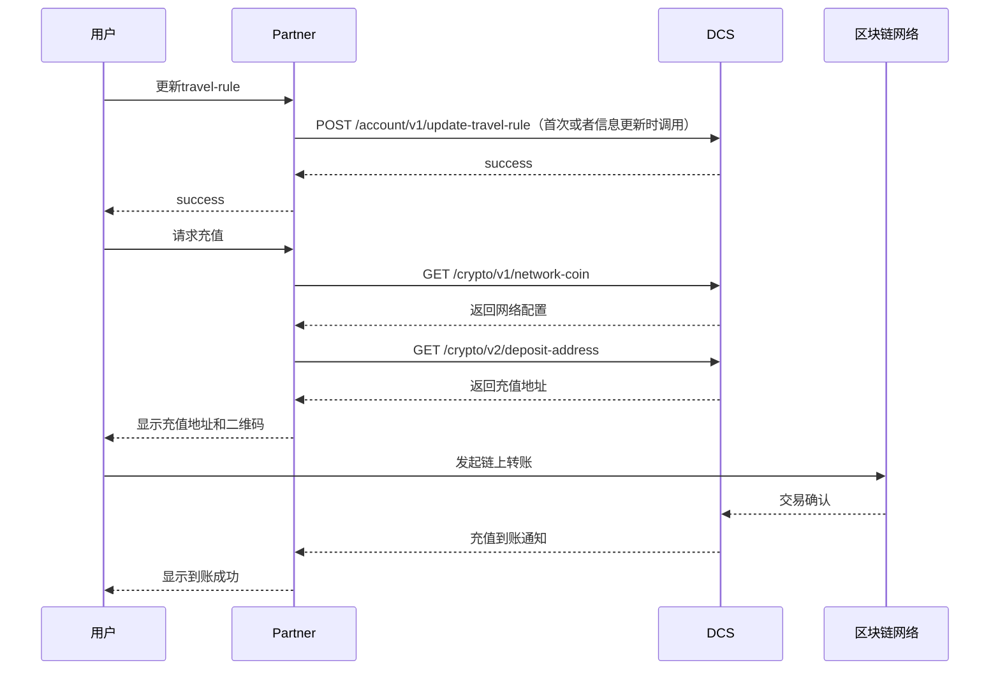

# 钱包功能使用指南

本指南详细介绍 DCS Standard Authorization  钱包功能的使用方法，包括网络配置查询、充值地址获取和数字资产提现等核心功能。

## 功能概述

DCS Standard Authorization 钱包模块提供以下核心功能：

### 网络配置管理
- **多网络支持**：支持 TRON、Ethereum、BSC、SOL、BASE、ARB 等主流区块链网络
- **币种配置查询**：获取支持的数字资产和网络配置信息
- **手续费信息**：查询充值提现的手续费和限额

### 充值服务
- **FOMO充值地址**：获取快速充值地址
- **银行转账充值**：获取银行转账充值信息
- **多网络支持**：支持多种区块链网络的充值

### 提现服务
- **数字资产提现**：支持多种数字资产的链上提现
- **手续费计算**：自动计算提现手续费
- **地址验证**：验证提现地址的有效性

## 主要功能流程

### 充值流程图

## 重要提醒

> [!WARNING]
> ### 充值注意事项
> - 请确认充值网络和币种匹配
> - 充值需要等待区块链网络确认
> - 请勿向充值地址发送不支持的币种
