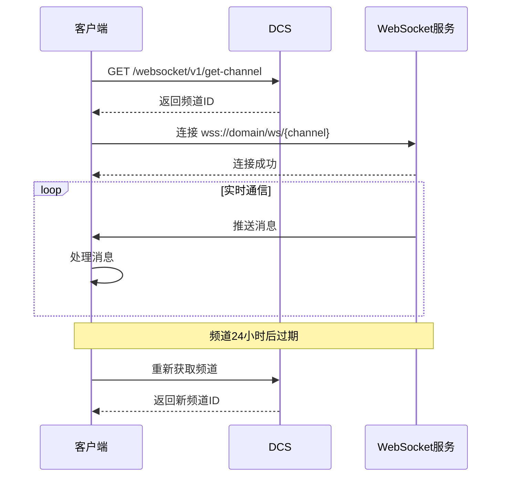
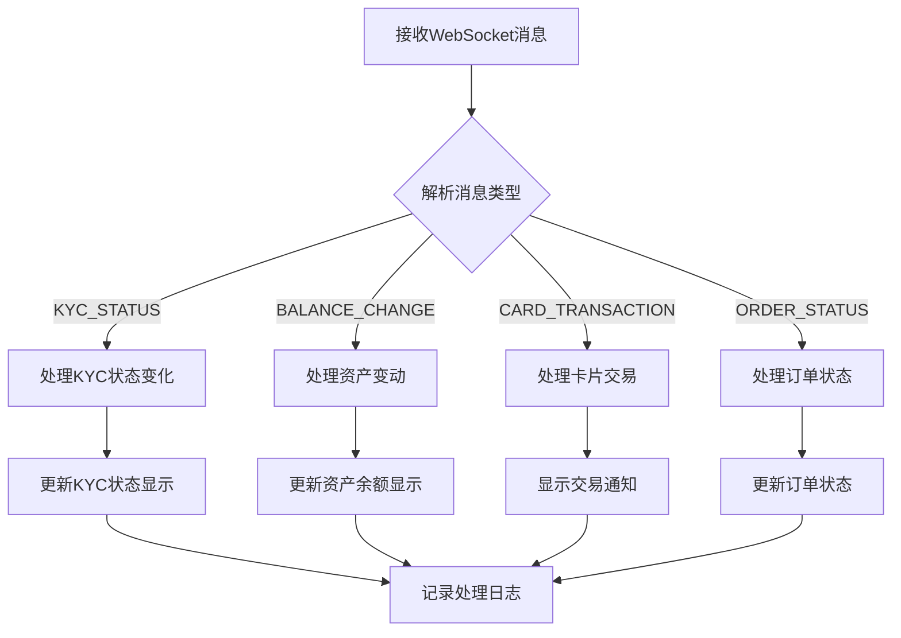

# WebSocket 实时通信使用指南

本指南详细介绍 DCS Standard Authorization WebSocket 实时通信功能的使用方法，包括频道管理、消息监听和事件处理。

## 功能概述

DCS Standard Authorization WebSocket 模块提供以下核心功能：

### 实时通知服务
- **KYC状态变化**：身份认证状态实时更新
- **资产变动通知**：余额变化实时推送
- **卡片交易通知**：消费交易实时通知
- **订单状态通知**：订单状态变化推送

### 频道管理
- **私有频道**：每个渠道的专属频道，确保数据安全
- **频道刷新**：24小时自动过期机制
- **消息查询**：支持根据版本号查询历史消息

## WebSocket 连接流程

### 连接建立流程图



### 消息处理流程图



## 支持的消息类型

### 1. KYC状态通知 (KYC_STATUS)

**触发时机：** 用户KYC认证状态发生变化时

**状态值：**
- `UNDO`：未做KYC
- `INIT`：初始状态
- `PENDING`：审核中
- `PASS`：审核通过
- `REFUSE`：审核拒绝

**消息示例：**
```json
{
  "type": "KYC_STATUS",
  "timestamp": "1731471194021",
  "version": "1",
  "externalUserId": "f1b718e0",
  "data": {
    "status": "PASS"
  }
}
```

### 2. 资产变动通知 (BALANCE_CHANGE)

**触发时机：** 用户资产余额发生变化时

**变动类型：** 与资产交易接口定义一致
- 充值、提现、转换、消费等

**消息示例：**
```json
{
  "type": "BALANCE_CHANGE",
  "timestamp": "1733980483134",
  "version": "2",
  "externalUserId": "9f8b5f82",
  "data": {
    "asset": "USD",
    "network": "",
    "freeDelta": "12.64",
    "freezeDelta": "0",
    "tranId": "4285261023005170688",
    "externalTranId": "4285261022921284608",
    "free": "12.64",
    "freeze": "0",
    "type": ""
  }
}
```

### 3. 卡片交易通知 (CARD_TRANSACTION)

**触发时机：** 用户进行卡片消费或退款时

**交易结果：**
- `A`：交易成功 (accept)
- `D`：交易失败 (deny)

**交易方向：**
- `CREDIT`：资金增加/退款
- `DEBIT`：资金扣减/消费

**消息示例：**
```json
{
  "type": "CARD_TRANSACTION",
  "timestamp": "1733981368030",
  "version": "3",
  "externalUserId": "9f8b5f82-610d-46e5-b006-3db6b2c8a395",
  "data": {
    "cardNumber": "**** **** **** 0617",
    "transactionCurrencyCode": "702",
    "transactionAmount": "20.2",
    "localTransactionDate": "1211",
    "localTransactionTime": "161420",
    "response": "D",
    "direction": "DEBIT",
    "systemTraceAuditNumber": "G_4295180843619725568",
    "requestAmountInUsd": "14.86",
    "externalTranId": "4285261022921284608"
  }
}
```

### 4. 订单状态通知 (ORDER_STATUS)

**触发时机：** 充值订单状态发生变化时

**订单状态：**
- `PENDING_NORMAL`：处理中（系统自动审核）
- `PENDING_CREDIT`：待入账（等待资金到账）
- `PENDING_AUDIT`：待审核（需人工确认）
- `SUCCESS`：成功（已完成）
- `FAILED`：失败（未完成）

**消息示例：**
```json
{
  "type": "ORDER_STATUS",
  "timestamp": "1733981368030",
  "version": "1",
  "externalUserId": "9f8b5f82-610d-46e5-b006-3db6b2c8a395",
  "data": {
    "txHash": "0x0d1c3de69760d09e528284c032d7b31bab4e492c0fee3efd69af74cd7a4fe05f",
    "transStatus": "PENDING_CREDIT",
    "amount": "2.59000000",
    "asset": "ETH",
    "network": "Ethereum",
    "creditAmount": "2.59000000",
    "creditCurrency": "SGD",
    "fromAddress": "0xed63647a0875ff48673e10ed632bc0cfd8664b89",
    "toaddress": "0x5caeec3c95d5dd77cfb399f0c73c106ce3b98b60",
    "convertAmount": "2.59000000",
    "convertCurrency": "USD",
    "convertFeeAmount": "2.59000000",
    "convertFeeCurrency": ""
  }
}
```

## 重要提醒

> [!WARNING]
> ### 频道管理注意事项
> - 私有频道存活时间为24小时，需要定期刷新
> - 获取新频道后，旧频道将不再推送数据
> - 建议提前1小时刷新频道，避免消息丢失